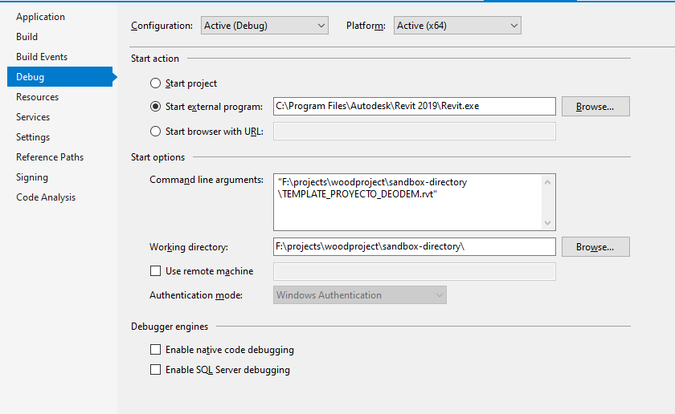

# WoodProject

## Description

WoodProject is an application that creates walls and floors in a rvt file. It takes a JSON file that specifies the walls and floors to be created, and outputs a new rvt file.

# Setup

## Prerequisites

1. **Visual Studio** 2017, 2019
2. **Revit** 2019 required to compile changes into the plugin
3. **7z zip** requires to create the bundle ZIP, [download here](https://www.7-zip.org/)

## References

This Revit plugin requires **RevitAPI** and **DesignAutomationBridge** references. The `Reference Path` option should point to the folder.

## Building WoodProject.sln

Clone this repository and open `SketchIt.sln` in Visual Studio.

Right-click on References, then Add Reference and Browse for RevitAPI.dll (by default under _C:\Program Files\Autodesk\Revit 201x_ folder). Then right-click on this RevitAPI reference, go to Properties, then set Copy Local to False.

Then right-click on the project, go to Manage NuGet Packages..., under Browser you can search for DesignAutomation.Revit and install _Autodesk.Forge.DesignAutomation.Revit_ (choose the appropriate Revit version you need). Then search and install _Newtonsoft.Json_ (which is used to parse input data in JSON format).

Please check Include pre-release while searching for packages. Design Automation for Revit is in beta (as of Jan/2019). 

In the WoodProject C# project, repair the references to `DesignAutomationBridge`, `Newtonsoft JSON framework` and `RevitAPI`.  You can do this by removing and re-adding the references, or by opening the `WoodProject.csproj` for edit and manually updating the reference paths.

Build `WoodProject.sln` in `Release` or `Debug` configuration.

`WoodProjectActivity` expects an input file `WoodProjectInput.json` and the template file specified in debug. The contents of the embedded JSON are stored in a file named `WoodProjectInput.json`, as specified by the `parameters` of `inputJson` in the activity `WoodProjectActivity`. The WoodProject application reads this file from current working folder, parses the JSON and creates walls and floors from the extracted specifications in a new created Revit file `woodproject_result.rvt`, which will be uploaded to `url` you provide in the workitem.

## Deploy WoodProject

- Use Postman collection "Design Automation For Revit Tutorial"
Tutorial at https://forge.autodesk.com/en/docs/design-automation/v3/tutorials/revit/ and https://github.com/Autodesk-Forge/forge-tutorial-postman/tree/master/DA4Revit

- Fill your postman environment variable (see the important variables not default below)

| Variable | Value |
|----------|----------|
| client_id | Your Forge client id |
| client_secret | Your forge client secret  |
|  dasNickName        |  deodemwoodproject        |
|  ossInputFileObjectKey        |  sandbox_2019        |
|  ossOutputFileObjectKey        |  result.rvt        |
|  appBundleName        |  WoodProjectApp        |

- Run Task2 - Get an Access Token

- Run Task4 - Update an Existing AppBundle

- Run Task 4 - Upload the Updated AppBundle (change the file parameter in body to select correct file)

- Run Task 4 - Assign an Existing Alias to the Updated AppBundle

# Further Reading

- [My First Revit Plugin](https://knowledge.autodesk.com/support/revit-products/learn-explore/caas/simplecontent/content/my-first-revit-plug-overview.html)
- [Revit Developer Center](https://www.autodesk.com/developer-network/platform-technologies/revit)
- [Design Automation For Revit Tutorial](https://forge.autodesk.com/en/docs/design-automation/v3/tutorials/revit)
